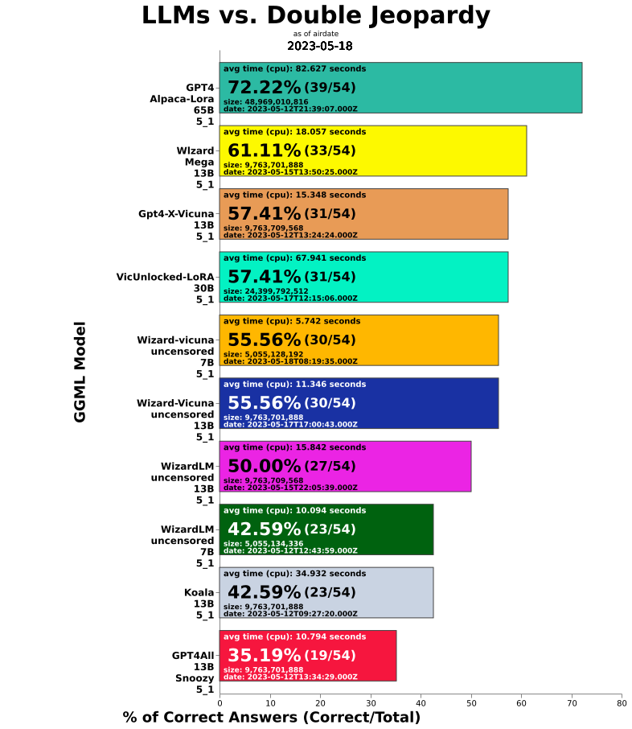

# llm-jeopardy

Automated prompting and scoring framework to evaluate LLMs using updated human knowledge prompts

Install and run:  
git clone https://github.com/aigoopy/llm-jeopardy.git  
npm install  
node . --help  

llm-jeopardy framework uses [llama.cpp](https://github.com/ggerganov/llama.cpp) for model execution and GGML models from [Hugging Face](https://huggingface.co). 
Updated with GGMLv3 models.

<!--- TABLESTART --->
|name|percent|modelcorrect|modeltotal|elapsed|answerlen|msize|mdate|
|----|----|----|----|----|----|----|----|
|<a href="https://huggingface.co/TheBloke/airoboros-65B-gpt4-1.2-GGML" target="_blank">Airoboros-Gpt4-1.2 65B-8_0</a>|81.68|156|191|31.177|12.96|69.37|2023/06/14 16:35:46|
|<a href="https://huggingface.co/TheBloke/airoboros-65B-gpt4-1.2-GGML" target="_blank">Airoboros-Gpt4-1.2 65B-5_1</a>|80.10|153|191|33.796|13.08|48.97|2023/06/14 15:25:37|
|<a href="https://huggingface.co/TheBloke/airoboros-33B-gpt4-1.2-GGML" target="_blank">Airoboros-Gpt4-1.2 33B-8_0</a>|76.44|146|191|19.299|13.21|34.56|2023/06/14 14:32:00|
|<a href="https://huggingface.co/TheBloke/WizardLM-30B-GGML" target="_blank">WizardLM 30B-8_0</a>|75.39|144|191|51.714|218.34|34.56|2023/06/06 21:08:15|
|<a href="https://huggingface.co/TheBloke/guanaco-65B-GGML" target="_blank">Guanaco 65B-8_0</a>|74.87|143|191|94.197|183.97|69.37|2023/05/26 08:46:34|
|<a href="https://huggingface.co/TheBloke/alpaca-lora-65B-GGML" target="_blank">Alpaca-Lora 65B-5_1</a>|74.35|142|191|43.105|38.99|48.97|2023/05/20 12:57:30|
|<a href="https://huggingface.co/TheBloke/hippogriff-30b-chat-GGML" target="_blank">Hippogriff 30B-8_0</a>|74.35|142|191|46.604|155.26|34.56|2023/05/31 09:16:01|
|<a href="https://huggingface.co/TheBloke/Wizard-Vicuna-30B-Uncensored-GGML" target="_blank">Wizard-Vicuna-Unc 30B-8_0</a>|73.30|140|191|39.490|125.43|34.56|2023/05/30 04:33:26|
|<a href="https://huggingface.co/TheBloke/WizardLM-Uncensored-SuperCOT-StoryTelling-30B-GGML" target="_blank">WizardLM-Unc-Supercot 30B-8_0</a>|72.25|138|191|44.330|146.41|34.56|2023/06/01 11:07:15|
|<a href="https://huggingface.co/TheBloke/WizardLM-30B-GGML" target="_blank">WizardLM 30B-6_K</a>|72.25|138|191|44.495|229.29|26.69|2023/06/06 19:03:43|
|<a href="https://huggingface.co/TheBloke/VicUnlocked-alpaca-65B-QLoRA-GGML" target="_blank">VicUnlocked-Alpaca 65B-8_0</a>|72.25|138|191|96.532|178.99|69.37|2023/05/30 00:09:02|
|<a href="https://huggingface.co/TheBloke/gpt4-alpaca-lora-30B-4bit-GGML" target="_blank">GPT4-Alpaca-Lora 30B-8_0</a>|71.73|137|191|46.223|157.68|34.56|2023/05/20 04:13:39|
|<a href="https://huggingface.co/TheBloke/WizardLM-30B-Uncensored-GGML" target="_blank">WizardLM-Unc 30B-8_0</a>|71.73|137|191|48.014|166.37|34.56|2023/05/22 14:34:25|
|<a href="https://huggingface.co/TheBloke/llama-30b-supercot-GGML" target="_blank">Llama-Supercot 30B-8_0</a>|71.20|136|191|33.509|94.94|34.56|2023/05/28 12:22:12|
|<a href="https://huggingface.co/TheBloke/wizardLM-13B-1.0-GGML" target="_blank">WizardLM-1.0 13B-8_0</a>|70.68|135|191|27.592|248.66|13.83|2023/05/27 16:17:01|
|<a href="https://huggingface.co/TheBloke/samantha-33B-GGML" target="_blank">Samantha 33B-8_0</a>|70.68|135|191|48.949|195.26|34.56|2023/05/29 10:18:08|
|<a href="https://huggingface.co/TheBloke/Alpaca-Lora-30B-GGML" target="_blank">Alpaca-Lora 30B-8_0</a>|70.16|134|191|28.561|65.68|34.56|2023/06/01 07:50:56|
|<a href="https://huggingface.co/TheBloke/guanaco-65B-GGML" target="_blank">Guanaco 65B-5_1</a>|69.63|133|191|81.315|190.84|48.97|2023/05/25 18:58:18|
|<a href="https://huggingface.co/TheBloke/airoboros-13B-gpt4-1.2-GGML" target="_blank">Airoboros-Gpt4-1.2 13B-8_0</a>|69.11|132|191|9.923|13.14|13.83|2023/06/16 13:03:21|
|<a href="https://huggingface.co/TheBloke/minotaur-13B-GGML" target="_blank">Minotaur 13B-8_0</a>|68.59|131|191|18.393|173.60|13.83|2023/06/08 21:45:25|
|<a href="https://huggingface.co/TheBloke/30B-Lazarus-GGML" target="_blank">Lazarus 30B-8_0</a>|68.59|131|191|42.808|145.82|34.56|2023/06/07 15:58:57|
|<a href="https://huggingface.co/TheBloke/Project-Baize-v2-13B-GGML" target="_blank">Baize-v2 13B-8_0</a>|67.54|129|191|22.406|188.08|13.83|2023/05/24 12:00:06|
|<a href="https://huggingface.co/TheBloke/gpt4-alpaca-lora_mlp-65B-GGML" target="_blank">GPT4-Alpaca-Lora-mlp 65B-5_1</a>|67.54|129|191|69.971|150.37|48.97|2023/05/20 17:04:49|
|<a href="https://huggingface.co/TheBloke/chronos-hermes-13B-GGML" target="_blank">Chronos-Hermes 13B-8_0</a>|67.02|128|191|21.256|183.42|13.83|2023/06/13 11:02:08|
|<a href="https://huggingface.co/TheBloke/WizardLM-13B-V1.0-Uncensored-GGML" target="_blank">WizardLM-Unc-1.0 13B-8_0</a>|66.49|127|191|35.591|261.57|13.83|2023/06/20 07:44:48|
|<a href="https://huggingface.co/TheBloke/chronos-wizardlm-uc-scot-st-13B-GGML" target="_blank">Chronos-WizardLM-Unc-Sc 13B-8_0</a>|65.97|126|191|22.338|188.27|13.83|2023/06/07 14:08:04|
|<a href="https://huggingface.co/TheBloke/tulu-30B-GGML" target="_blank">Tulu 30B-8_0</a>|65.45|125|191|18.883|20.25|34.56|2023/06/10 21:47:05|
|<a href="https://huggingface.co/TheBloke/wizard-mega-13B-GGML" target="_blank">Wlzard-Mega 13B-8_0</a>|65.45|125|191|20.367|174.62|13.83|2023/05/20 03:50:25|
|<a href="https://huggingface.co/TheBloke/13B-HyperMantis-GGML" target="_blank">Hypermantis 13B-8_0</a>|64.92|124|191|13.800|103.15|13.83|2023/06/03 00:38:54|
|<a href="https://huggingface.co/TheBloke/based-30B-GGML" target="_blank">Based 30B-8_0</a>|64.92|124|191|19.685|33.47|34.56|2023/06/03 10:54:07|
|<a href="https://huggingface.co/TheBloke/Nous-Hermes-13B-GGML" target="_blank">Nous-Hermes 13B-8_0</a>|64.40|123|191|15.565|105.24|13.83|2023/06/03 13:44:45|
|<a href="https://huggingface.co/TheBloke/LLaMa-30B-GGML" target="_blank">Llama 30B-8_0</a>|64.40|123|191|50.401|168.13|34.56|2023/05/20 19:50:17|
|<a href="https://huggingface.co/TheBloke/gpt4-x-vicuna-13B-GGML" target="_blank">Gpt4-X-Vicuna 13B-8_0</a>|63.87|122|191|20.500|186.05|13.83|2023/05/20 05:02:06|
|<a href="https://huggingface.co/TheBloke/vicuna-13b-v1.3-GGML" target="_blank">Vicuna-1.3 13B-8_0</a>|63.87|122|191|34.381|325.28|13.83|2023/06/18 18:11:39|
|<a href="https://huggingface.co/TheBloke/13B-Chimera-GGML" target="_blank">Chimera 13B-8_0</a>|62.83|120|191|15.169|123.14|13.83|2023/06/03 13:08:37|
|<a href="https://huggingface.co/TheBloke/guanaco-7B-GGML" target="_blank">Guanaco 7B-8_0</a>|62.83|120|191|35.143|682.66|7.16|2023/05/25 20:18:25|
|<a href="https://huggingface.co/TheBloke/wizard-vicuna-13B-GGML" target="_blank">Wizard-Vicuna 13B-8_0</a>|62.30|119|191|14.006|98.16|13.83|2023/05/20 02:44:04|
|<a href="https://huggingface.co/TheBloke/Wizard-Vicuna-13B-Uncensored-GGML" target="_blank">Wizard-Vicuna-Unc 13B-8_0</a>|62.30|119|191|14.273|99.29|13.83|2023/05/20 02:05:09|
|<a href="https://huggingface.co/TheBloke/Manticore-13B-GGML" target="_blank">Manticore 13B-8_0</a>|62.30|119|191|16.662|131.08|13.83|2023/05/20 14:17:21|
|<a href="https://huggingface.co/TheBloke/WizardLM-7B-V1.0-Uncensored-GGML" target="_blank">WizardLM-Unc-1.0 7B-8_0</a>|60.73|116|191|20.344|298.81|7.16|2023/06/18 12:59:11|
|<a href="https://huggingface.co/TheBloke/airoboros-7B-gpt4-1.2-GGML" target="_blank">Airoboros-Gpt4-1.2 7B-8_0</a>|58.64|112|191|6.727|17.38|7.16|2023/06/16 12:45:31|
|<a href="https://huggingface.co/TheBloke/Vigogne-Instruct-13B-GGML" target="_blank">Vigogne-Instruct 13B-8_0</a>|58.12|111|191|19.852|139.10|13.83|2023/05/25 21:58:38|
|<a href="https://huggingface.co/TheBloke/Wizard-Vicuna-7B-Uncensored-GGML" target="_blank">Wizard-Vicuna-Unc 7B-8_0</a>|55.50|106|191|7.649|82.62|7.16|2023/05/20 01:07:29|
|<a href="https://huggingface.co/TheBloke/Project-Baize-v2-7B-GGML" target="_blank">Baize-v2 7B-8_0</a>|55.50|106|191|13.099|182.70|7.16|2023/05/24 11:38:45|
|<a href="https://huggingface.co/TheBloke/koala-13B-GGML" target="_blank">Koala 13B-8_0</a>|53.93|103|191|39.531|432.57|13.83|2023/05/20 05:33:31|
|<a href="https://huggingface.co/TheBloke/wizardLM-7B-GGML" target="_blank">WizardLM 7B-8_0</a>|52.36|100|191|13.448|196.15|7.16|2023/05/20 00:19:49|
|<a href="https://huggingface.co/TheBloke/VicUnlocked-30B-LoRA-GGML" target="_blank">VicUnlocked-LoRA 30B-8_0</a>|52.36|100|191|77.912|271.86|34.56|2023/05/20 22:52:56|
|<a href="https://huggingface.co/TheBloke/koala-7B-GGML" target="_blank">Koala 7B-8_0</a>|50.26|96|191|25.657|482.70|9.76|2023/05/20 00:45:54|
|<a href="https://huggingface.co/TheBloke/GPT4All-13B-snoozy-GGML" target="_blank">GPT4All-Snoozy 13B-8_0</a>|46.60|89|191|14.131|98.54|13.83|2023/05/20 03:14:27|
