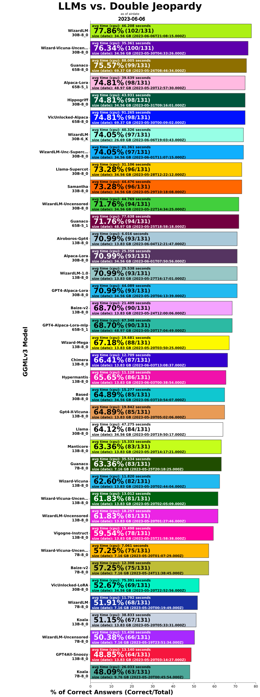

# llm-jeopardy

Automated prompting and scoring framework to evaluate LLMs using updated human knowledge prompts

Install and run:  
git clone https://github.com/aigoopy/llm-jeopardy.git  
npm install  
node . --help  

llm-jeopardy framework uses [llama.cpp](https://github.com/ggerganov/llama.cpp) for model execution and GGML models from [Hugging Face](https://huggingface.co). 
Updated with GGMLv3 models.

<!--- TABLESTART --->
|name|percent|modelcorrect|modeltotal|elapsed|answerlen|msize|mdate|
|----|----|----|----|----|----|----|----|
|<a href="https://huggingface.co/TheBloke/airoboros-65B-gpt4-1.2-GGML" target="_blank">Airoboros-Gpt4-1.2 65B-8_0</a>|82.38|201|244|35.898|12.75|69.37|2023/06/14 16:35:46|
|<a href="https://huggingface.co/TheBloke/airoboros-65B-gpt4-1.2-GGML" target="_blank">Airoboros-Gpt4-1.2 65B-5_1</a>|81.15|198|244|35.862|12.90|48.97|2023/06/14 15:25:37|
|<a href="https://huggingface.co/TheBloke/airoboros-65B-gpt4-1.4-GGML" target="_blank">Airoboros-Gpt4-1.4 65B-8_0</a>|80.33|196|244|42.993|22.95|69.37|2023/06/29 20:25:57|
|<a href="https://huggingface.co/TheBloke/airoboros-33B-gpt4-1.4-GGML" target="_blank">Airoboros-Gpt4-1.4 33B-8_0</a>|77.46|189|244|22.641|17.52|34.56|2023/06/26 17:53:42|
|<a href="https://huggingface.co/TheBloke/WizardLM-30B-GGML" target="_blank">WizardLM 30B-8_0</a>|75.41|184|244|55.375|217.21|34.56|2023/06/06 21:08:15|
|<a href="https://huggingface.co/TheBloke/guanaco-65B-GGML" target="_blank">Guanaco 65B-8_0</a>|74.59|182|244|99.213|183.09|69.37|2023/05/26 08:46:34|
|<a href="https://huggingface.co/TheBloke/alpaca-lora-65B-GGML" target="_blank">Alpaca-Lora 65B-5_1</a>|74.18|181|244|45.045|36.27|48.97|2023/05/20 12:57:30|
|<a href="https://huggingface.co/TheBloke/Wizard-Vicuna-30B-Uncensored-GGML" target="_blank">Wizard-Vicuna-Unc 30B-8_0</a>|73.77|180|244|42.090|124.48|34.56|2023/05/30 04:33:26|
|<a href="https://huggingface.co/TheBloke/hippogriff-30b-chat-GGML" target="_blank">Hippogriff 30B-8_0</a>|73.77|180|244|48.663|155.30|34.56|2023/05/31 09:16:01|
|<a href="https://huggingface.co/TheBloke/WizardLM-30B-Uncensored-GGML" target="_blank">WizardLM-Unc 30B-8_0</a>|73.36|179|244|50.852|167.21|34.56|2023/05/22 14:34:25|
|<a href="https://huggingface.co/TheBloke/gpt4-alpaca-lora-30B-4bit-GGML" target="_blank">GPT4-Alpaca-Lora 30B-8_0</a>|72.95|178|244|49.984|158.64|34.56|2023/05/20 04:13:39|
|<a href="https://huggingface.co/TheBloke/WizardLM-30B-GGML" target="_blank">WizardLM 30B-6_K</a>|72.13|176|244|48.489|233.48|26.69|2023/06/06 19:03:43|
|<a href="https://huggingface.co/TheBloke/VicUnlocked-alpaca-65B-QLoRA-GGML" target="_blank">VicUnlocked-Alpaca 65B-8_0</a>|72.13|176|244|100.842|175.63|69.37|2023/05/30 00:09:02|
|<a href="https://huggingface.co/TheBloke/llama-30b-supercot-GGML" target="_blank">Llama-Supercot 30B-8_0</a>|71.72|175|244|36.158|94.84|34.56|2023/05/28 12:22:12|
|<a href="https://huggingface.co/TheBloke/Platypus-30B-GGML" target="_blank">Platypus 30B-8_0</a>|71.31|174|244|25.398|24.61|34.56|2023/06/29 01:30:17|
|<a href="https://huggingface.co/TheBloke/WizardLM-Uncensored-SuperCOT-StoryTelling-30B-GGML" target="_blank">WizardLM-Unc-Supercot 30B-8_0</a>|71.31|174|244|46.707|146.13|34.56|2023/06/01 11:07:15|
|<a href="https://huggingface.co/TheBloke/GPlatty-30B-GGML" target="_blank">GPlatty 30B-8_0</a>|70.49|172|244|28.595|36.07|34.56|2023/06/29 00:01:01|
|<a href="https://huggingface.co/TheBloke/samantha-33B-GGML" target="_blank">Samantha 33B-8_0</a>|70.49|172|244|52.228|194.14|34.56|2023/05/29 10:18:08|
|<a href="https://huggingface.co/TheBloke/airoboros-13B-gpt4-1.2-GGML" target="_blank">Airoboros-Gpt4-1.2 13B-8_0</a>|70.08|171|244|10.593|12.99|13.83|2023/06/16 13:03:21|
|<a href="https://huggingface.co/TheBloke/airoboros-13B-gpt4-1.4-GGML" target="_blank">Airoboros-Gpt4-1.4 13B-8_0</a>|70.08|171|244|11.839|18.93|13.83|2023/06/22 08:32:58|
|<a href="https://huggingface.co/TheBloke/Alpaca-Lora-30B-GGML" target="_blank">Alpaca-Lora 30B-8_0</a>|70.08|171|244|30.379|61.95|34.56|2023/06/01 07:50:56|
|<a href="https://huggingface.co/TheBloke/wizardLM-13B-1.0-GGML" target="_blank">WizardLM-1.0 13B-8_0</a>|69.26|169|244|28.163|243.60|13.83|2023/05/27 16:17:01|
|<a href="https://huggingface.co/TheBloke/guanaco-65B-GGML" target="_blank">Guanaco 65B-5_1</a>|69.26|169|244|84.168|187.89|48.97|2023/05/25 18:58:18|
|<a href="https://huggingface.co/TheBloke/minotaur-13B-GGML" target="_blank">Minotaur 13B-8_0</a>|68.85|168|244|19.717|168.77|13.83|2023/06/08 21:45:25|
|<a href="https://huggingface.co/TheBloke/gpt4-alpaca-lora_mlp-65B-GGML" target="_blank">GPT4-Alpaca-Lora-mlp 65B-5_1</a>|68.85|168|244|73.537|149.36|48.97|2023/05/20 17:04:49|
|<a href="https://huggingface.co/TheBloke/30B-Lazarus-GGML" target="_blank">Lazarus 30B-8_0</a>|68.44|167|244|45.635|145.80|34.56|2023/06/07 15:58:57|
|<a href="https://huggingface.co/TheBloke/vicuna-33B-GGML" target="_blank">Vicuna 33B-8_0</a>|67.62|165|244|54.182|177.84|34.56|2023/06/30 16:08:40|
|<a href="https://huggingface.co/TheBloke/WizardLM-13B-V1.0-Uncensored-GGML" target="_blank">WizardLM-Unc-1.0 13B-8_0</a>|67.21|164|244|34.983|264.98|13.83|2023/06/20 07:44:48|
|<a href="https://huggingface.co/TheBloke/Nous-Hermes-13B-GGML" target="_blank">Nous-Hermes 13B-8_0</a>|66.80|163|244|16.754|103.99|13.83|2023/06/03 13:44:45|
|<a href="https://huggingface.co/TheBloke/chronos-hermes-13B-GGML" target="_blank">Chronos-Hermes 13B-8_0</a>|66.80|163|244|22.891|185.11|13.83|2023/06/13 11:02:08|
|<a href="https://huggingface.co/TheBloke/tulu-30B-GGML" target="_blank">Tulu 30B-8_0</a>|66.39|162|244|21.691|19.94|34.56|2023/06/10 21:47:05|
|<a href="https://huggingface.co/TheBloke/Project-Baize-v2-13B-GGML" target="_blank">Baize-v2 13B-8_0</a>|66.39|162|244|23.687|187.39|13.83|2023/05/24 12:00:06|
|<a href="https://huggingface.co/TheBloke/chronos-wizardlm-uc-scot-st-13B-GGML" target="_blank">Chronos-WizardLM-Unc-Sc 13B-8_0</a>|65.57|160|244|24.556|205.23|13.83|2023/06/07 14:08:04|
|<a href="https://huggingface.co/TheBloke/wizard-mega-13B-GGML" target="_blank">Wlzard-Mega 13B-8_0</a>|65.16|159|244|21.780|175.93|13.83|2023/05/20 03:50:25|
|<a href="https://huggingface.co/TheBloke/LLaMa-30B-GGML" target="_blank">Llama 30B-8_0</a>|65.16|159|244|52.560|168.73|34.56|2023/05/20 19:50:17|
|<a href="https://huggingface.co/TheBloke/gpt4-x-vicuna-13B-GGML" target="_blank">Gpt4-X-Vicuna 13B-8_0</a>|64.75|158|244|21.824|183.37|13.83|2023/05/20 05:02:06|
|<a href="https://huggingface.co/TheBloke/vicuna-13b-v1.3.0-GGML" target="_blank">Vicuna-1.3.0 13B-8_0</a>|64.34|157|244|37.754|312.95|13.83|2023/06/25 11:15:58|
|<a href="https://huggingface.co/TheBloke/airoboros-7B-gpt4-1.4-GGML" target="_blank">Airoboros-Gpt4-1.4 7B-8_0</a>|63.93|156|244|7.516|22.26|7.16|2023/06/22 07:53:28|
|<a href="https://huggingface.co/TheBloke/Wizard-Vicuna-13B-Uncensored-GGML" target="_blank">Wizard-Vicuna-Unc 13B-8_0</a>|63.52|155|244|15.860|99.89|13.83|2023/05/20 02:05:09|
|<a href="https://huggingface.co/TheBloke/13B-Chimera-GGML" target="_blank">Chimera 13B-8_0</a>|63.52|155|244|16.735|123.11|13.83|2023/06/03 13:08:37|
|<a href="https://huggingface.co/TheBloke/based-30B-GGML" target="_blank">Based 30B-8_0</a>|63.52|155|244|23.133|34.60|34.56|2023/06/03 10:54:07|
|<a href="https://huggingface.co/TheBloke/13B-HyperMantis-GGML" target="_blank">Hypermantis 13B-8_0</a>|63.11|154|244|14.650|92.65|13.83|2023/06/03 00:38:54|
|<a href="https://huggingface.co/TheBloke/Manticore-13B-GGML" target="_blank">Manticore 13B-8_0</a>|63.11|154|244|18.489|131.04|13.83|2023/05/20 14:17:21|
|<a href="https://huggingface.co/TheBloke/guanaco-7B-GGML" target="_blank">Guanaco 7B-8_0</a>|62.30|152|244|36.463|719.40|7.16|2023/05/25 20:18:25|
|<a href="https://huggingface.co/TheBloke/airoboros-7B-gpt4-1.2-GGML" target="_blank">Airoboros-Gpt4-1.2 7B-8_0</a>|61.07|149|244|7.088|16.54|7.16|2023/06/16 12:45:31|
|<a href="https://huggingface.co/TheBloke/wizard-vicuna-13B-GGML" target="_blank">Wizard-Vicuna 13B-8_0</a>|61.07|149|244|15.633|102.40|13.83|2023/05/20 02:44:04|
|<a href="https://huggingface.co/TheBloke/Selfee-13B-GGML" target="_blank">Selfee 13B-8_0</a>|60.66|148|244|29.229|183.16|13.83|2023/06/06 14:23:41|
|<a href="https://huggingface.co/TheBloke/Vigogne-Instruct-13B-GGML" target="_blank">Vigogne-Instruct 13B-8_0</a>|60.25|147|244|19.410|123.73|13.83|2023/05/25 21:58:38|
|<a href="https://huggingface.co/TheBloke/WizardLM-7B-V1.0-Uncensored-GGML" target="_blank">WizardLM-Unc-1.0 7B-8_0</a>|58.61|143|244|19.738|285.40|7.16|2023/06/18 12:59:11|
|<a href="https://huggingface.co/TheBloke/Project-Baize-v2-7B-GGML" target="_blank">Baize-v2 7B-8_0</a>|56.97|139|244|13.680|181.52|7.16|2023/05/24 11:38:45|
|<a href="https://huggingface.co/TheBloke/UltraLM-13B-GGML" target="_blank">UltraLM 13B-8_0</a>|56.15|137|244|19.558|135.45|13.83|2023/06/29 21:37:25|
|<a href="https://huggingface.co/TheBloke/Wizard-Vicuna-7B-Uncensored-GGML" target="_blank">Wizard-Vicuna-Unc 7B-8_0</a>|54.92|134|244|8.667|80.91|7.16|2023/05/20 01:07:29|
|<a href="https://huggingface.co/TheBloke/koala-13B-GGML" target="_blank">Koala 13B-8_0</a>|54.10|132|244|39.957|421.22|13.83|2023/05/20 05:33:31|
|<a href="https://huggingface.co/TheBloke/VicUnlocked-30B-LoRA-GGML" target="_blank">VicUnlocked-LoRA 30B-8_0</a>|53.28|130|244|82.583|268.42|34.56|2023/05/20 22:52:56|
|<a href="https://huggingface.co/TheBloke/wizardLM-7B-GGML" target="_blank">WizardLM 7B-8_0</a>|52.46|128|244|14.428|198.03|7.16|2023/05/20 00:19:49|
|<a href="https://huggingface.co/TheBloke/open-llama-13b-open-instruct-GGML" target="_blank">Open-Llama-Instruct 13B-8_0</a>|51.64|126|244|20.588|122.91|13.83|2023/06/20 14:21:08|
|<a href="https://huggingface.co/TheBloke/koala-7B-GGML" target="_blank">Koala 7B-8_0</a>|51.23|125|244|25.906|470.40|9.76|2023/05/20 00:45:54|
|<a href="https://huggingface.co/TheBloke/GPT4All-13B-snoozy-GGML" target="_blank">GPT4All-Snoozy 13B-8_0</a>|45.90|112|244|15.167|94.17|13.83|2023/05/20 03:14:27|
